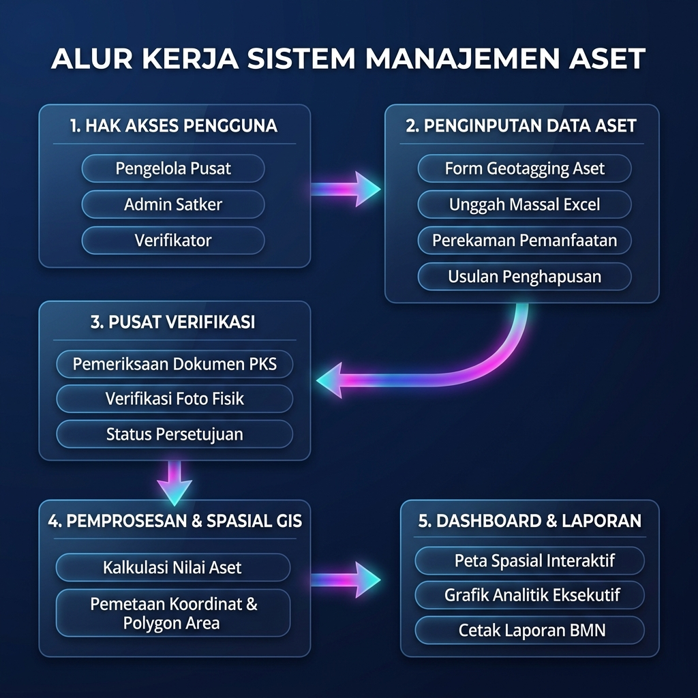

# Diagram Alur Sistem Informasi Manajemen Aset (BMN & PTN)

Dokumentasi alur kerja (*flowchart*) dan infografis visual aplikasi Sistem Informasi Manajemen Aset BMN & PTN.

---

## 1. Infografis Flowchart Visual (Bahasa Indonesia)



---

## 2. Diagram Alur Kerja Interaktif (Mermaid Diagram)

```mermaid
flowchart TD
    classDef auth fill:#1e293b,stroke:#3b82f6,stroke-width:2px,color:#fff
    classDef input fill:#0f172a,stroke:#06b6d4,stroke-width:2px,color:#fff
    classDef verify fill:#312e81,stroke:#6366f1,stroke-width:2px,color:#fff
    classDef process fill:#064e3b,stroke:#10b981,stroke-width:2px,color:#fff
    classDef output fill:#4c1d95,stroke:#a855f7,stroke-width:2px,color:#fff

    subgraph AKSES["1. Hak Akses & Pengguna"]
        A["Masuk ke Aplikasi"] ::: auth --> B["Halaman Autentikasi"] ::: auth
        B --> C{"Pemeriksaan Peran Pengguna"} ::: auth
        C -->|Pengelola Pusat| D1["Kelola Satker, Pengguna & Pengaturan Sistem"] ::: auth
        C -->|Admin Satker| D2["Akses Fitur Penginputan & Pengajuan Aset"] ::: auth
        C -->|Verifikator| D3["Akses Pusat Verifikasi Data & Pengajuan"] ::: auth
    end

    subgraph INPUT["2. Penginputan Data Aset"]
        D2 --> E1["Input Aset Manual & Penentuan Lokasi Peta"] ::: input
        D2 --> E2["Unggah Data Massal (Import File Excel/CSV)"] ::: input
        D2 --> E3["Perekaman Pemanfaatan (Sewa, Pinjam Pakai, KSP, KETUPI)"] ::: input
        D2 --> E4["Pelaporan Permasalahan & Usulan Penghapusan BMN"] ::: input
    end

    subgraph VERIFIKASI["3. Pusat Verifikasi Data"]
        E1 --> F["Pusat Verifikasi Data"] ::: verify
        E2 --> F
        E3 --> F
        E4 --> F
        F --> G{"Pemeriksaan Dokumen PKS & Foto Fisik"} ::: verify
        G -->|Ditolak| H["Pengembalian Berkas ke Admin Satker + Catatan Revisi"] ::: verify
        G -->|Disetujui| I["Pembaruan Master Data Aset Terverifikasi"] ::: verify
    end

    subgraph PROSES["4. Pemprosesan Data & Spasial GIS"]
        I --> J1["Pemetaan Titik Koordinat & Area Batas Peta"] ::: process
        I --> J2["Kalkulasi Otomatis Masa Berlaku & Nilai Pemanfaatan"] ::: process
        I --> J3["Pencatatan Histori Aset & Jejak Audit"] ::: process
    end

    subgraph LAPORAN["5. Visualisasi & Laporan Eksekutif"]
        J1 --> K1["Peta Spasial Interaktif (Tampilan Marker & Layer Batas Area)"] ::: output
        J2 --> K2["Dashboard Eksekutif (Grafik Ringkasan Statisik Aset)"] ::: output
        J3 --> K3["Cetak Laporan BMN & Viewer Dokumen PDF Embedded"] ::: output
    end
```

---

## 3. Penjelasan Rinci Alur Kerja Sistem

### **1. Hak Akses & Peran Pengguna**
- **Masuk Aplikasi**: Pengguna membuka halaman login dan memasukkan kredensial akun.
- **Pengelola Pusat (Superadmin)**: Mengelola struktur perguruan tinggi/satker, membuat akun pengguna baru, serta mengatur preferensi aplikasi secara terpusat.
- **Admin Satker**: Bertugas menginputkan data aset baru, melakukan *bulk upload*, mencatatkan pemanfaatan lahan/bangunan, serta melaporkan masalah aset di lingkungan unit kerjanya.
- **Verifikator**: Bertanggung jawab memeriksa kelengkapan dokumen pendukung (PDF PKS/KTP) dan keabsahan data fisik sebelum data masuk secara sah ke dalam master sistem.

### **2. Penginputan & Perekaman Data Aset**
- **Perekaman Manual**: Pengisian data barang (Merk, NUP, Nilai Perolehan) beserta penandaan lokasi spasial (*Geotagging*) pada peta.
- **Unggah Data Massal**: Fitur import ribuan baris data aset secara praktis dari file CSV atau Excel.
- **Perekaman Pemanfaatan**: Fitur pencatatan status pemanfaatan resmi BMN meliputi *Sewa*, *Pinjam Pakai*, *Kerjasama Pemanfaatan (KSP)*, *Bangun Guna Serah (BGS/BSG)*, dan *KETUPI*.
- **Pelaporan Masalah & Penghapusan**: Pencatatan sengketa lahan, kerusakan berat, atau draf pengusulan penghapusan BMN.

### **3. Pusat Verifikasi Data**
- Seluruh entri data baru maupun pengajuan pemanfaatan akan tertampung di **Pusat Verifikasi**.
- Verifikator meninjau foto fisik aset dan mengecek dokumen PDF PKS melalui penampil dokumen (*PDF Viewer*) interaktif.
- Data yang **Disetujui** akan mengubah status master aset secara *real-time*. Data yang **Ditolak** dikembalikan ke Admin Satker disertai catatan perbaikan.

### **4. Pemprosesan Data & Spasial GIS**
- Penentuan titik lokasi koordinat dan pembentukan polygon area batas wilayah aset pada sistem GIS.
- Penghitungan otomatis tanggal mulai s.d. tanggal berakhir pemanfaatan aset.
- Perekaman riwayat (*audit trail*) untuk menjaga transparansi pengelolaan aset.

### **5. Dashboard & Laporan Eksekutif**
- **Peta Spasial Interaktif**: Visualisasi peta sebaran aset di seluruh wilayah dengan penanda lokasi, galeri foto dokumentasi, dan overlay area.
- **Dashboard Eksekutif**: Ringkasan eksekutif berisi akumulasi nilai aset, grafik rekapitulasi per Satker, dan persentase kategori aset.
- **Cetak Laporan**: Kemudahan mengunduh dan mencetak laporan resmi pengelolaan aset BMN.
