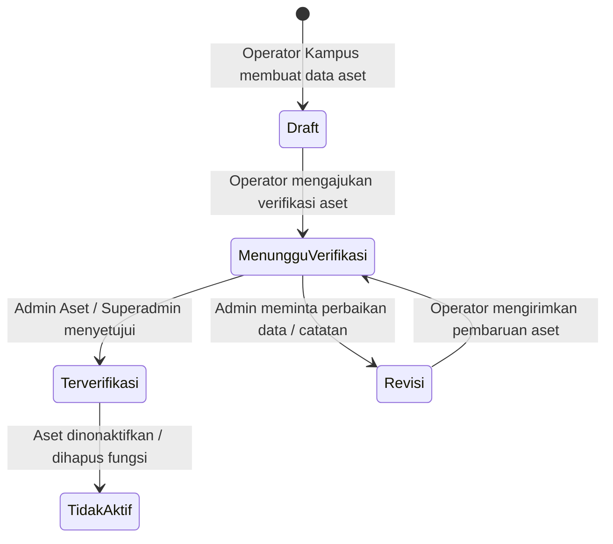

# Laporan Knowledge Graph Graphify: Sistem Manajemen Aset Universitas

**Waktu Pembaruan:** 28 Juli 2026  
**Direktori Proyek:** `c:\xampp\htdocs\manajemenaset`  
**Teknologi Utama:** Next.js (App Router) + PostgreSQL / Supabase + Leaflet GIS  

---

## 1. Ringkasan Arsitektur Eksekutif

`manajemenaset` adalah Sistem Informasi Manajemen Aset Perguruan Tinggi (Universitas) berstandar enterprise yang dibangun menggunakan **Next.js 15 (App Router)**, **TypeScript**, **PostgreSQL** (melalui library `pg` dan pola local repository atau opsi fallback Supabase), serta **TailwindCSS / Leaflet GIS**.

Aplikasi ini mengelola aset tanah dan bangunan di berbagai kampus, melacak status hukum/kepemilikan, alur kerja verifikasi bertingkat, kontrak pemanfaatan pihak ketiga (PKS), manajemen masalah/perbaikan aset, serta dasbor analitik eksekutif.

---

## 2. Komunitas & Subsistem Teridentifikasi

```
+-----------------------------------------------------------------------------------+
|                                 APP SHELL & ROUTING                               |
|   src/app/layout.tsx | src/app/page.tsx | src/app/map/page.tsx                    |
|   src/components/app-shell.tsx | src/components/sidebar.tsx                     |
+-------------------------+-------------------------+-------------------------------+
                          |                         |
        +-----------------+                         +-----------------+
        |                                                             |
+-------v-------------------------+                 +-----------------v-------------+
|    KOMUNITAS KOMPONEN UI        |                 |      REST API ENDPOINTS       |
| - src/components/assets/*       |                 | - /api/assets                 |
|   (table, form, modal, badge)   |  <-- HTTP API --| - /api/auth/*                 |
| - dashboard.tsx                 |                 | - /api/issues/*               |
| - full-page-map.tsx / GIS       |                 | - /api/utilizations           |
| - utilization-manager.tsx       |                 | - /api/uploads                |
| - issue-manager.tsx             |                 | - /api/mvp-data               |
| - user-role-manager.tsx         |                 +-----------------+-------------+
| - executive-analytics.tsx       |                                   |
+-------------------------+-------+                                   |
                          |                                           |
+-------------------------v-------+                 +-----------------v-------------+
| TIPE & UTILITAS BERSAMA         |                 | SERVER REPOSITORY & SESI      |
| - src/lib/types.ts (God Node)   |                 | - local-repository.ts         |
| - src/lib/role-utils.ts         |                 | - db.ts (PostgreSQL Pool)     |
| - src/lib/geo.ts                |                 | - session.ts (JWT / Cookies)  |
| - src/lib/date-utils.ts         |                 | - password.ts (bcrypt)        |
+---------------------------------+                 +-----------------+-------------+
                                                                      |
                                                    +-----------------v-------------+
                                                    | RELATIONAL DATABASE (POSTGRES)|
                                                    | db/schema.sql                 |
                                                    | - roles & profiles            |
                                                    | - assets, land & building     |
                                                    | - asset_photos & documents    |
                                                    | - asset_utilizations          |
                                                    | - asset_issues & progress     |
                                                    +-------------------------------+
```

### Komunitas 1: Data & Lapisan Persistensi (`db/` & `src/lib/server/`)
- **Berkas Utama**: `db/schema.sql`, `src/lib/server/db.ts`, `src/lib/server/local-repository.ts`, `src/lib/supabase.ts`
- **Tanggung Jawab**: Penyimpanan skema relasional, eksekusi query SQL, connection pooling, transaksi database, dan integrasi fallback Supabase.

### Komunitas 2: Backend API & Autentikasi (`src/app/api/` & `src/lib/server/session.ts`)
- **Berkas Utama**: `src/app/api/assets/route.ts`, `src/app/api/auth/*/route.ts`, `src/app/api/issues/*/route.ts`, `src/app/api/utilizations/route.ts`, `src/app/api/uploads/route.ts`, `src/lib/server/session.ts`
- **Tanggung Jawab**: Routing REST API, manajemen sesi berbasis cookie HTTP-only, validasi peran RBAC, upload berkas multipart, enkripsi kata sandi.

### Komunitas 3: Komponen Antarmuka Pengguna / UI (`src/components/`)
- **Berkas Utama**: `src/components/assets/*` (`asset-table.tsx`, `asset-form-drawer.tsx`, `asset-detail-modal.tsx`), `dashboard.tsx`, `full-page-map.tsx`, `utilization-manager.tsx`, `issue-manager.tsx`, `user-role-manager.tsx`, `executive-analytics.tsx`, `app-shell.tsx`
- **Tanggung Jawab**: Antarmuka interaktif, pemetaan koordinat GIS Leaflet full page, formulir registrasi aset, alur status verifikasi aset, dan dasbor administratif.

### Komunitas 4: Tipe & Utilitas Terbagi (`src/lib/`)
- **Berkas Utama**: `src/lib/types.ts`, `src/lib/role-utils.ts`, `src/lib/geo.ts`, `src/lib/date-utils.ts`, `src/lib/assets.ts`, `src/lib/storage.ts`
- **Tanggung Jawab**: Struktur data domain utama, kalkulasi koordinat GIS GeoJSON, validasi hak akses pengguna, format tanggal Indonesia, dan pemetaan URL file.

---

## 3. "God Nodes" & Hub Kritis Arsitektur

| Node / Berkas | Tipe | Skor Sentralitas | Jumlah Dependensi | Catatan Tata Kelola |
|---|---|---|---|---|
| `src/lib/types.ts` | Pusat Definisi Tipe | **Sangat Tinggi** | Diimpor oleh 20+ berkas | Kontrak domain utama. Perubahan tipe memerlukan verifikasi TypeScript menyeluruh. |
| `src/lib/server/local-repository.ts` | Akses Data Backend | **Sangat Tinggi** | Eksekusi 25+ query SQL | Titik tunggal interaksi database PostgreSQL lokal. |
| `src/components/assets/asset-form-drawer.tsx` | UI Drawer Form | **Tinggi** | Form modal CRUD & uploader | Mengelola pembuatan & penyuntingan aset beserta lampiran foto/dokumen. |
| `db/schema.sql` | Definisi Database | **Tinggi** | 10 Tabel Relasional | Sumber kebenaran skema tabel dan relasi foreign key. |
| `src/lib/role-utils.ts` | Utilitas Akses (RBAC) | **Sedang-Tinggi** | Diimpor seluruh modul UI | Evaluasi hak akses Superadmin, Admin Aset, Operator Kampus, dan Pimpinan. |

---

## 4. Alur Kerja Verifikasi Aset & Diagram Status



---

## 5. Status & Rekomendasi Pemeliharaan Kode

1. **Modularisasi `asset-list.tsx` (Selesai)**: Berhasil memecah monolitisasi `asset-list.tsx` menjadi modul terisolasi di `src/components/assets/` (`asset-table.tsx`, `asset-form-drawer.tsx`, `asset-detail-modal.tsx`, `asset-status-badge.tsx`).
2. **Full Page Map Route (Selesai)**: Penambahan rute independen `/map` di `src/app/map/page.tsx` dengan `full-page-map.tsx`.
3. **Konsistensi Tipe Data**: Memastikan keselarasan tipe antara `db/schema.sql`, `src/lib/types.ts`, dan `src/lib/server/local-repository.ts`.
4. **Optimasi Query Spasial GIS**: Untuk data peta spasial berukuran besar, pertimbangkan penambahan indeks PostGIS pada kolom `geometry_geojson` atau `latitude`/`longitude`.

