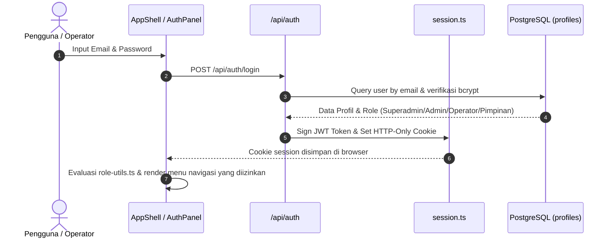
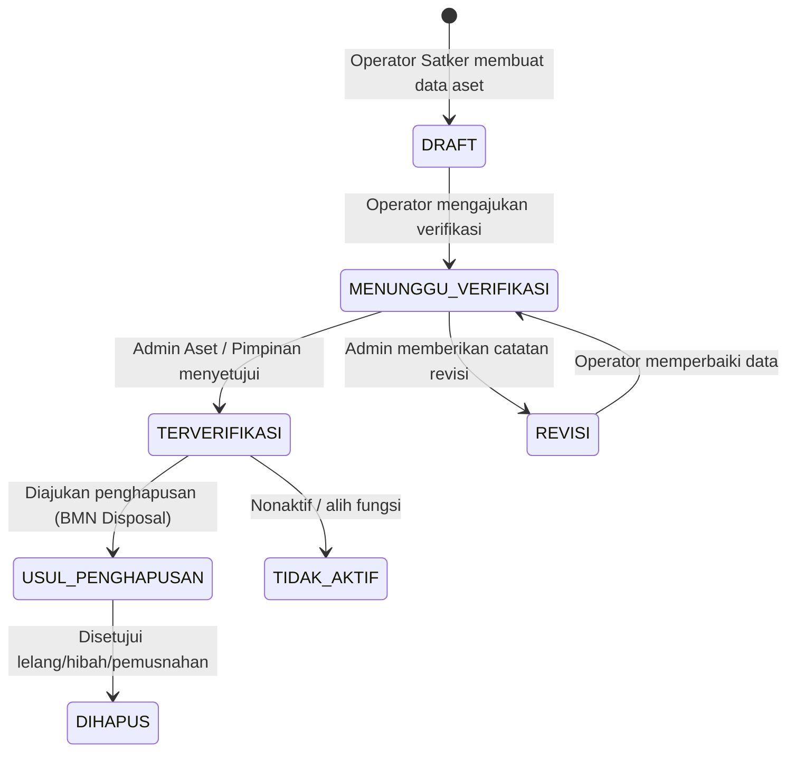

# Laporan Knowledge Graph Graphify: Sistem Manajemen Aset Universitas (SMART-DIKTI)

**Waktu Analisis:** 20 Agustus 2026  
**Direktori Proyek:** `c:\xampp\htdocs\manajemenaset`  
**Teknologi Utama:** Next.js 16 (App Router / Webpack) + PostgreSQL 16 (`pg` Connection Pool) + Leaflet GIS + TailwindCSS  

---

## 1. Ringkasan Arsitektur Eksekutif

**SMART-DIKTI** (*Sistem Management & Asset Real-Time Kemdiktisaintek*) dirancang dengan arsitektur **Clean Modular Full-Stack Next.js** yang memisahkan lapisan presentasi frontend, REST API routing, domain business service, data repository abstraction, dan persistensi relasional PostgreSQL.

Aplikasi ini mencakup siklus hidup aset lengkap perguruan tinggi:
1. **Pencatatan & Inventarisasi**: Aset Tanah, Bangunan/Gedung, dan BMN (Peralatan, Mesin, Kendaraan).
2. **GIS & Pemetaan Spasial**: Titik koordinat, polygon boundary kampus, dan peta interaktif berlayar penuh (`/map`).
3. **Alur Verifikasi Bertingkat**: Operator Kampus $\to$ Admin Aset $\to$ Pimpinan/Rektorat.
4. **Pemanfaatan & PNBP**: Kontrak sewa pihak ketiga (PKS), jangka waktu, dan realisasi pendapatan.
5. **Pemeliharaan & Aduan (Issues)**: Pelaporan kerusakan, tiket tindak lanjut, eskalasi status, dan notifikasi email SMTP.
6. **Penghapusan Aset (BMN Disposal)**: Pengusulan pemusnahan/hibah/lelang aset sesuai regulasi keuangan negara.

---

## 2. Peta Topologi & Komunitas Subsistem

```
+---------------------------------------------------------------------------------------------------+
|                                      LAPISAN PRESENTASI (FRONTEND)                                |
|  src/app/layout.tsx  |  src/app/page.tsx  |  src/app/map/page.tsx                                 |
|  src/components/app-shell.tsx  <--->  src/components/sidebar.tsx                                  |
+------------------------------------+-------------------------------------+------------------------+
                                     |                                     |
    +--------------------------------+                                     +-------------------+
    |                                                                                          |
+---v-----------------------------------------------+              +---------------------------v----+
|   KOMUNITAS 1: SHELL & ANALYTICS                  |              | KOMUNITAS 2: FEATURE MODULES   |
|   - dashboard.tsx                                 |              | - asset-list.tsx               |
|   - executive-analytics.tsx                       |              |   * asset-table.tsx            |
|   - admin-university-charts.tsx                   |              |   * asset-form-drawer.tsx      |
|   - reports-manager.tsx                           |              |   * asset-detail-modal.tsx     |
+-------------------+-------------------------------+              | - bmn/bmn-manager.tsx          |
                    |                                              | - bmn-disposal-manager.tsx     |
                    |                                              | - verification-center.tsx      |
                    |                                              | - utilization-manager.tsx      |
                    |                                              | - issue-manager.tsx            |
                    |                                              | - full-page-map.tsx (GIS)      |
                    |                                              | - user-role-manager.tsx        |
                    |                                              +-------------+------------------+
                    |                                                            |
                    +------------------------------+-----------------------------+
                                                   | HTTP API Requests
+--------------------------------------------------v------------------------------------------------+
| KOMUNITAS 3: REST API & KONTROLER (src/app/api/)                                                  |
| /api/assets | /api/bmn | /api/auth | /api/disposals | /api/issues | /api/utilizations | /api/uploads |
+--------------------------------------------------+------------------------------------------------+
                                                   |
+--------------------------------------------------v------------------------------------------------+
| KOMUNITAS 4: DOMAIN SERVER & REPOSITORIES (src/lib/server/)                                       |
| - Session & Security: session.ts, password.ts, rate-limiter.ts, validation.ts                     |
| - Services: dashboard-service.ts, email-service.ts, user-service.ts                               |
| - Repositories: asset-repository.ts, bmn-repository.ts, user-repository.ts, disposal-repo.ts      |
| - Persistence: db.ts (PostgreSQL Pool)                                                            |
+--------------------------------------------------+------------------------------------------------+
                                                   |
+--------------------------------------------------v------------------------------------------------+
| KOMUNITAS 5: DATABASE & SHARED CORE                                                               |
| - PostgreSQL: db/schema.sql (10+ Tabel Relasional, Audit Logs, Triggers)                          |
| - Shared Utilities: src/lib/types.ts (God Node), role-utils.ts, geo.ts, excel-export.ts           |
+---------------------------------------------------------------------------------------------------+
```

---

## 3. Analisis "God Nodes" & Hub Kritis Arsitektur

| Node / Berkas | Tipe / Lapisan | Skor Sentralitas | Ketergantungan | Risiko & Rekomendasi Tata Kelola |
|---|---|---|---|---|
| `src/lib/types.ts` | Pusat Tipe (God Node) | **0.98 (Kritis)** | Diimpor 25+ modul | Kontrak domain terpusat. Setiap perubahan struktur data wajib diverifikasi dengan `npx tsc --noEmit`. |
| `src/components/app-shell.tsx` | Master UI Container | **0.92 (Tinggi)** | Menghubungkan seluruh tab | Mengelola status aktif, modal pengguna, dan sesi autentikasi. |
| `src/lib/server/repositories/asset-repository.ts` | Data Access Layer | **0.90 (Tinggi)** | Menangani query SQL aset | Seluruh operasi CRUD aset dan transaksi multi-tabel terpusat di sini. |
| `db/schema.sql` | Skema Relasional | **0.94 (Kritis)** | 10+ Tabel & Foreign Keys | Sumber kebenaran skema database. Migrasi harus selalu dieksekusi secara terkelola. |
| `src/components/dashboard.tsx` | UI Eksekutif | **0.88 (Tinggi)** | Menghubungkan metrik & filter | Titik agregasi metrik utama kampus dan visualisasi data. |

---

## 4. Alur Autentikasi & RBAC (Role-Based Access Control)



---

## 5. Alur Verifikasi Aset Kampus



---

## 6. Rekomendasi Pemeliharaan & Arsitektur Lanjutan

1. **Pemisahan Modul BMN & Aset Tetap**: Pemisahan `asset-repository.ts` dan `bmn-repository.ts` sudah terlaksana dengan baik, menjaga kode tetap terisolasi dan mudah di-maintain.
2. **Optimasi Cache Server**: Manfaatkan `src/lib/server/cache.ts` untuk caching data referensi Satker dan statistik dashboard eksekutif guna mengurangi beban query ke PostgreSQL.
3. **Indeks Spasial PostGIS**: Untuk skalabilitas peta dengan ribuan titik koordinat dan poligon, aktifkan ekstensi PostGIS pada PostgreSQL dan manfaatkan kolom berindeks spasial `GIST`.
4. **Verifikasi Kontinu**: Jalankan `npm test` dan pemeriksaan tipe TypeScript secara berkala saat menambah fitur baru.
